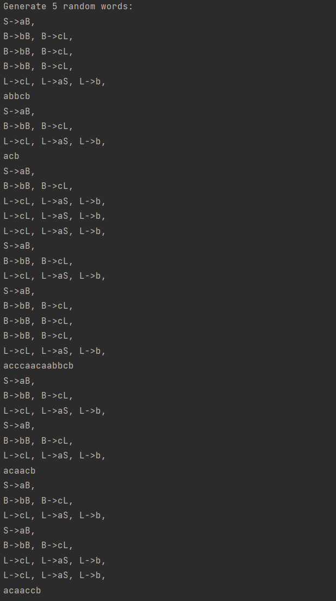
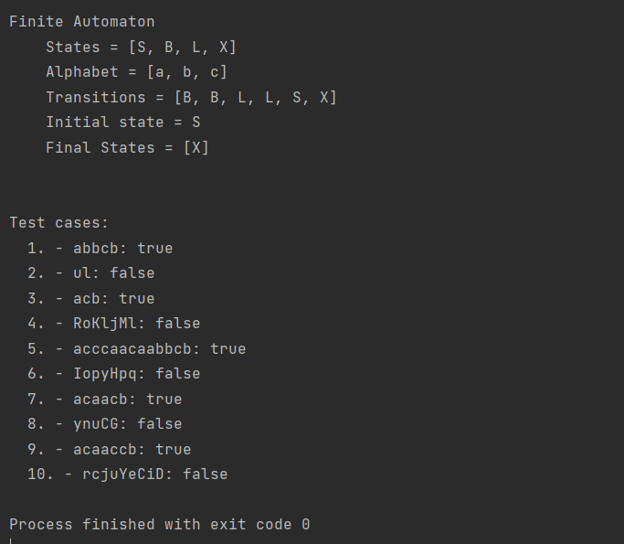

# Topic: Intro to formal languages. Regular grammars. Finite Automata.
## Course: Formal Languages & Finite Automata
## Author: Corețchi Mihai FAF-211
Variant 10:

VN={S, B, L},

VT={a, b, c},

P={

  S → aB
 
  B → bB

  B → cL

  L → cL

  L → aS

  L → b

}

## Theory
Formal languages are a way to represent and describe sets of strings using a set of rules or symbols. Formal languages can be classified into different types based on their properties.
Finite automata are computational models that operate by following a set of rules to process strings.
The basic idea behind them is to read an input string, and transition between states based on the current input character and the current state, and it designed to accept or reject the string based on the set of rules.
## Objectives:
- Understand what a language is and what it needs to have in order to be considered a formal one.

- Provide the initial setup for the evolving project:

    a. Create a local && remote repository of a VCS hosting service

    b. Choose a programming language

    c. Create a separate folder the report will be kept

- According to my variant 6, get the grammar definition and do the following tasks:

    a. Implement a type/class for the grammar;

    b. Add one function that would generate 5 valid strings from the language expressed by the given grammar

    c. Implement some functionality that would convert and object of type Grammar to one of type Finite Automaton;

    d. For the Finite Automaton, add a method that checks if an input string can be obtained via the state transition from it
## Implementation description
### GenerateWord
- The function recursively generates a string by applying the grammar rules associated with the given non-terminal symbol.
- It initializes an empty StringBuilder to build the final output string and a list of possible productions that have the given symbol as their left-hand side.
- The function then selects a random production from the list and retrieves the right-hand side of the selected production.
- It loops through each character in the right-hand side string and either recursively calls itself with the non-terminal character or appends the character to the StringBuilder, depending on whether the character is a non-terminal symbol or a terminal symbol, respectively.
- Finally, the function returns the contents of the StringBuilder as a string, which represents the output string generated by applying the grammar rules associated with the given non-terminal symbol.

```java
private String generateWord(char symbol) {
StringBuilder result = new StringBuilder();

          ArrayList<Production> possibleProductions = new ArrayList<>();
          for (Production production : this.productions) {
              if (production.getLeftSide().charAt(0) == symbol) {
                  possibleProductions.add(production);
                  System.out.print(production.print() +", ");
              }
          }
          System.out.println();
          SecureRandom random = new SecureRandom();
          int randomIndex = random.nextInt(possibleProductions.size());
          String rightSide = possibleProductions.get(randomIndex).getRightSide();

          for (int i = 0; i < rightSide.length(); i++) {
              char currentSymbol = rightSide.charAt(i);
              if (isNonTerminal(currentSymbol)) {
                  result.append(generateWord(currentSymbol));
              } else {
                  result.append(currentSymbol);
              }
          }

          return result.toString();
      }
```
### toFiniteAutomaton
- The method converts a context-free grammar into a finite automaton.

- It constructs the set of possible states by taking the union of non-terminal variables with the final state 'X'.

- The method defines the alphabet as the set of terminal variables.

- It constructs the set of transitions by mapping the productions of the grammar to transitions in the finite automaton.

- The method sets the initial state to be the starting character of the grammar and the final state to be 'X'.

- Finally, the method returns a new instance of a FiniteAutomaton class, which represents the converted grammar as a finite automaton.

```java
public FiniteAutomaton toFiniteAutomaton() {
        
        char[] possibleStates = this.nonTerminalVariables;
        char[] newPossibleStates = new char[possibleStates.length + 1];
        System.arraycopy(possibleStates, 0, newPossibleStates, 0, possibleStates.length);
        newPossibleStates[newPossibleStates.length - 1] = 'X';
        possibleStates = newPossibleStates;

        char[] alphabet = terminalVariables;

        Transition[] transitions = new Transition[this.productions.length];

        int i = 0;
        for (Production production : this.productions) {
            char currentState = production.getLeftSide().charAt(0);
            char nextState = production.getRightSide().length() > 1 ? production.getRightSide().charAt(1) : 'X';
            char transitionLabel = production.getRightSide().charAt(0);
            transitions[i] = new Transition(currentState, nextState, transitionLabel);
            i++;
        }

        char initialState = startingCharacter;
        char[] finalStates = new char[]{'X'};

        return new FiniteAutomaton(possibleStates, alphabet, transitions, initialState, finalStates);
    }
```

### isWordValid

- The method checks if a given input string is a valid word of the grammar by simulating the non-deterministic finite automaton that recognizes the grammar.

- It uses a set of current states, initially set to the epsilon closure of the initial state, to track the possible states that the automaton could be in after reading the first character of the input string.

- The method loops through each character of the input string and updates the set of possible states based on the transitions from the current states that consume the current character.

- If the set of possible states is empty at any point, the method returns false.

- After processing the entire input string, the method checks if any of the final states of the automaton are present in the set of possible states, and returns true if a final state is found, and false otherwise.

```java
public boolean isWordValid(String str) {
        Set<Character> currentStates = epsilonClosure(this.initialState);

        for (char c : str.toCharArray()) {
            Set<Character> nextStates = new HashSet<>();

            for (char currentState : currentStates) {
                for (Transition t : this.transitions) {
                    if (t.getCurrentState() == currentState &&
                            t.getTransitionLabel() == c) {
                        nextStates.addAll(epsilonClosure(t.getNextState()));
                    }
                }
            }

            if (nextStates.isEmpty()) {
                return false;
            }

            currentStates = nextStates;
        }

        for (char finalState : this.finalStates) {
            if (currentStates.contains(finalState)) {
                return true;
            }
        }

        return false;
    }
```

### epsilonClosure
```java
public Set<Character> epsilonClosure(char state) {
Set<Character> closure = new HashSet<>();
closure.add(state);

        Stack<Character> stack = new Stack<>();
        stack.push(state);

        while (!stack.isEmpty()) {
            char currentState = stack.pop();
            for (Transition t : transitions) {
                if (t.getCurrentState() == currentState && t.getTransitionLabel() == 'e') {
                    char nextState = t.getNextState();
                    if (!closure.contains(nextState)) {
                        closure.add(nextState);
                        stack.push(nextState);
                    }
                }
            }
        }

        return closure;
    }
```
This code uses a depth-first search algorithm to traverse the finite automaton and identify all states that can be reached by epsilon transitions from the input state. It then returns these states as a set of characters.

## Results


## Conclusions
In conclusion, after I did this lab work I can say that I was able to gain a better understanding of formal languages and implement a grammar in code.
I created a class grammar that is responsible for generating a word from the given variables and the grammar into a finite automaton. The class Production is a builder for the class Grammar. The class FiniteAutomaton is responsible for checking if the generated word is corresponding to the rules. The class Transition is responsible for keeping the current and next state, a helper for the FiniteAutomaton class. In class Tools, I created the function generateRandomString() that generates a random  and I use it for checking if the automaton works.       
