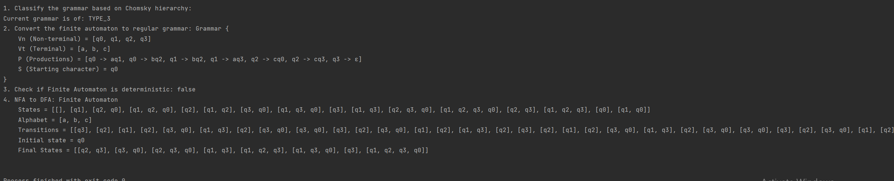

# Determinism in Finite Automata. Conversion from NFA to DFA. Chomsky Hierarchy.
## Course: Formal Languages & Finite Automata
## Author: Corețchi Mihai FAF-211
Variant 10

Q = {q0,q1,q2,q3},

∑ = {a,b,c},

F = {q3},

δ(q0,a) = q1,

δ(q1,b) = q2,

δ(q2,c) = q3,

δ(q3,a) = q1,

δ(q1,b) = q1,

δ(q0,b) = q2.


## Theory
A finite automaton is a device utilized to depict various kinds of processes, similar to a state machine in terms of its structure and purpose. The term "finite" denotes that an automaton possesses a starting state and a set of final states, meaning that any process modeled by an automaton has a clear beginning and end.
Depending on the structure of the automaton, there may be cases where a single transition leads to multiple states, resulting in non-determinism. Determinism refers to how predictable a system is when discussing systems theory. When there are random variables present, the system becomes non-deterministic or stochastic.
As a result, automata can be categorized as either deterministic or non-deterministic, and it is possible to achieve determinism by utilizing algorithms that alter the automaton's structure.
Chomsky Hierarchy is a system of classifying formal languages into four categories based on the complexity of their grammars:
- Regular languages
- Context-free languages
- Context-sensitive languages
- Recursively enumerable languages

A non-deterministic finite automaton NFA is a type of finite automaton that can have multiple transitions for a given input symbol from a particular state. In contrast, a deterministic finite automaton DFA is a type of finite automaton that has only one transition for a given input symbol from a particular state.
To convert an NFA to a DFA, we need to create a new DFA that accepts the same language as the NFA. We create a state in the DFA for each possible combination of states in the NFA. The transitions between states in the DFA are determined by examining the possible transitions from each state in the NFA for each input symbol. If a set of states in the NFA includes a final state, then the corresponding state in the DFA is also a final state.
## Objectives:
- Understand what an automaton is and what it can be used for.

- Continuing the work in the same repository and the same project, the following need to be added:

  a. Provide a function in your grammar type/class that could classify the grammar based on Chomsky hierarchy.

  b. For this you can use the variant from the previous lab.

- According to your variant number (by universal convention it is register ID), get the finite automaton definition and do the following tasks:

  a. Implement conversion of a finite automaton to a regular grammar.

  b. Determine whether your FA is deterministic or non-deterministic.

  c. Implement some functionality that would convert an NDFA to a DFA.

  d. Represent the finite automaton graphically:
    - You can use external libraries, tools or APIs to generate the figures/diagrams.
    - Your program needs to gather and send the data about the automaton and the lib/tool/API return the visual representation.

## Implementation description
### isDeterministic
This code checks whether the finite automaton represented by the object is deterministic or not. It does so by creating a transition map that maps the current state and input symbol to a set of next states. If any state in the automaton has multiple transitions for the same input symbol, then the automaton is non-deterministic and the method returns false. Otherwise, the automaton is deterministic and the method returns true. The method takes no arguments and returns a boolean value.

```java
public boolean isDeterministic() {
        Map<String, Map<String, Set<String>>> transitionMap = new HashMap<>();

        for (Transition t : transitions) {
        String sourceState = t.getCurrentState();
        String inputSymbol = String.valueOf(t.getTransitionLabel());

        if (!transitionMap.containsKey(sourceState)) {
            transitionMap.put(sourceState, new HashMap<>());
        }
        if (!transitionMap.get(sourceState).containsKey(inputSymbol)) {
            transitionMap.get(sourceState).put(inputSymbol, new HashSet<>());
        }

        transitionMap.get(sourceState).get(inputSymbol).add(t.getNextState());
        }

        for (String state : states) {
            for (String symbol : alphabet) {
                if (transitionMap.containsKey(state) && transitionMap.get(state).containsKey(symbol)
                && transitionMap.get(state).get(symbol).size() > 1) {
                    return false;
                }
            }
        }

        return true;
        }
```
### convertToDFA
This code converts a non-deterministic finite automaton NFA to a deterministic finite automaton DFA. It does so by creating a power set of all possible states of the NFA, creating a new DFA transition table, and then using the transition table to create the DFA.
The method creates a power set of all possible states of the NFA by calling the "getPowerSet" method, which returns a set of sets representing all possible combinations of states. The method then creates a new DFA transition table by iterating over all state sets in the power set and creating a set of next states for each symbol in the alphabet by examining the possible transitions from each state in the current state set for each input symbol. Finally, the method creates a new DFA by initializing the new DFA with the transition table, final states, and initial state.

```java
    public FiniteAutomaton convertToDFA() {
        Set<Set<String>> powerSet = getPowerSet(states);
        Map<Set<String>, Map<String, Set<String>>> dfaTransitions = new HashMap<>();
        Set<String> dfaFinalStates = new HashSet<>();
        String dfaInitialState = "{" + initialState + "}";

        for (Set<String> stateSet : powerSet) {
            Map<String, Set<String>> transitions = new HashMap<>();
            for (String symbol : alphabet) {
                Set<String> nextStates = new HashSet<>();
                for (String state : stateSet) {
                    for (Transition transition : transitionsFrom(state, symbol)) {
                        nextStates.add(transition.getNextState());
                    }
                }
                if (!nextStates.isEmpty()) {
                    transitions.put(symbol, nextStates);
                }
            }
            dfaTransitions.put(stateSet, transitions);
            if (Arrays.asList(finalStates).contains(stateSet.toString())) {
            dfaFinalStates.add(stateSet.toString());
            }
        }
```

### isRegularGrammar, isContextFreeGrammar, isContextSensitiveGrammar

- The isRegularGrammar() method checks if the right-hand side of every production consists of either a single lowercase letter or two symbols where the first symbol is uppercase and the second is lowercase. If all productions satisfy this condition, then the grammar is regular.

- The isContextFreeGrammar() method checks if the left-hand side of every production is a single uppercase letter and the right-hand side consists of either uppercase or lowercase letters. If all productions satisfy this condition, then the grammar is context-free.

- The isContextSensitiveGrammar() method checks if the length of the left-hand side of every production is less than or equal to the length of the right-hand side. If all productions satisfy this condition, then the grammar is context-sensitive.

```java
public boolean isRegularGrammar() {
        for (Production p : productions) {
        String rhs = p.getRightSide();
        if (rhs.length() == 1 && Character.isLowerCase(rhs.charAt(0))) {
        continue;
        } else if (rhs.length() == 2) {
        char firstSymbol = rhs.charAt(0);
        char secondSymbol = rhs.charAt(1);
        if (Character.isUpperCase(firstSymbol) && Character.isLowerCase(secondSymbol)) {
        continue;
        } else if (Character.isLowerCase(firstSymbol) && Character.isUpperCase(secondSymbol)) {
        continue;
        }
        }
        return false;
        }

        return true;
        }

public boolean isContextFreeGrammar() {
        for (Production production : productions) {
        String leftSide = production.getLeftSide();
        String rightSide = production.getRightSide();
        if (leftSide.length() != 1 || !Character.isUpperCase(leftSide.charAt(0))) {
        return false;
        }
        for (int i = 0; i < rightSide.length(); i++) {
        char symbol = rightSide.charAt(i);
        if (!Character.isUpperCase(symbol) && !Character.isLowerCase(symbol)) {
        return false;
        }
        }
        }
        return true;
        }

public boolean isContextSensitiveGrammar() {
        for (Production p : productions) {
        String leftSide = p.getLeftSide();
        String rightSide = p.getRightSide();

        if (leftSide.length() > rightSide.length()) {
        return false;
        }
        }

        return true;
        }
```


## Results

## Conclusions
In conclusion, after I did this lab work I can say that I was able to gain a better understanding of determinism in Finite Automata, conversion from NFA to DFA and Chomsky Hierarchy.
In class FiniteAutomaton I created the methods convertToRegularGrammar, isDeterministic, convertToDFA, getPowerSet, transitionsFrom. In class Grammar I added the methods classifyGrammar, isRegularGrammar, isContextFreeGrammar, isContextSensitiveGrammar.      
